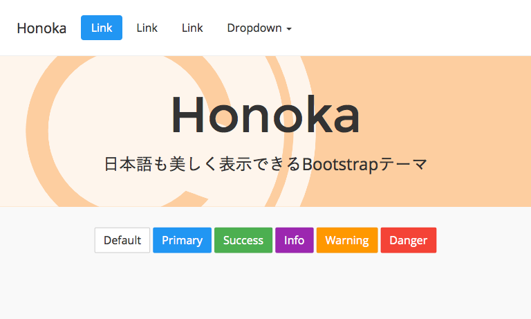

# Honoka

"Honoka" は日本語も美しく表示できるBootstrapテーマです。

## About "Honoka"

通常の[Bootstrap](http://getbootstrap.com/)では，日本語のフォント指定や文字サイズは最適とはいえません。

## Usage

基本的な使い方は本家のBootstrapとほとんど変わりません。ダウンロードしたフォルダ内にある ``bootstrap.min.css`` をHTMLにロードします。
