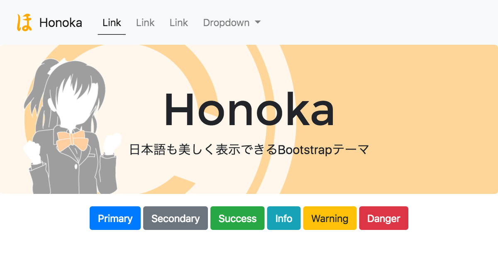

# Honoka

[](https://travis-ci.org/windyakin/Honoka)
[](https://ci.appveyor.com/project/windyakin/honoka/branch/master)
[](https://david-dm.org/windyakin/Honoka?type=dev)
[](LICENSE)
[](https://www.npmjs.com/package/bootstrap-honoka)
[](https://gitter.im/bootstrap-honoka/Lobby?utm_source=badge&utm_medium=badge&utm_campaign=pr-badge&utm_content=badge)

[http://honokak.osaka/](http://honokak.osaka/)

[](http://honokak.osaka/)

"Honoka" は日本語も美しく表示できる Bootstrap テーマです。

## About "Honoka"

通常の [Bootstrap](http://getbootstrap.com/) では、日本語の表示が最適であるとはいえません。 "Honoka" では Bootstrap をベースに、日本語表示に適したフォントの指定や、ウェイトに関するコードを追記した Bootstrap テーマです。

## Live Demo

* [http://honokak.osaka/bootstrap-ja.html](http://honokak.osaka/bootstrap-ja.html) (日本語レイアウト)
* [http://honokak.osaka/bootstrap.html](http://honokak.osaka/bootstrap.html) (英語レイアウト)

## Getting Started

### Download

[Releases](https://github.com/windyakin/Honoka/releases) ページから最新版をダウンロードしてください。

### npm

Node.js のパッケージ管理システムである、 [npm](https://npmjs.com) で [公開されています](https://www.npmjs.com/package/bootstrap-honoka)。 [webpack](https://webpack.js.org/) など、npmを利用したmodule bundlerでご利用ください。

```
npm install --save bootstrap-honoka
```

パッケージ名の先頭に **bootstrap-** があることに注意してください。

### Bower

[Bower](http://bower.io/) からインストールすることができます。

最新版をインストールするには以下のコマンドを実行してください。

```
bower install --save-dev $(node -e "$(curl -fsSL https://cdn.honokak.osaka/last.js)" windyakin Honoka)
```

もしcURLが入っていない環境の場合には、

```
bower install --save-dev Honoka#(version)
```

`(version)` には Honoka のバージョン番号を指定します(ex. `Honoka#3.3.5-c`)。 Honoka の最新バージョン番号は [Releases](https://github.com/windyakin/Honoka/releases) ページから確認してください。

## Usage

Honoka は Bootstrap のテーマにしか過ぎないため、基本的な使い方は Bootstrap と変わりません。  Bootstrap のスタイルシートの読み込みを Honoka のスタイルシートに置き換えることで動作します。また JavaScript のコードは変更されていないので、 Bootstrap のものを使っても問題ありません。

そのほか Bootstrap の機能の詳細については [Bootstrap のドキュメント](https://getbootstrap.com/docs/4.1/getting-started/introduction/) を参照してください。

### Package

配布している ZIP ファイルの内容物は以下のとおりです。 `bootstrap.min.css` といったように、ファイル名に `min` がついているファイルは、改行やインデント・スペーシングをなくした(minifyされた)コードで、ユーザがウェブページを読み込む際の転送量を少なくすることができます。通常はこの `bootstrap.min.*` を使うことをおすすめします。

```
honoka/
├─ LICENSE
├─ README.md
├─ bootstrap.html
├─ css/
│  ├─ bootstrap.css
│  └─ bootstrap.min.css
└─ js/
    ├─ bootstrap.bundle.js
    ├─ bootstrap.bundle.min.js
    ├─ bootstrap.js
    └─ bootstrap.min.js
```

## Build

ビルドの方法については [Wiki](https://github.com/windyakin/Honoka/wiki) をご覧ください。

## License

[MIT License](LICENSE)

## Author

* windyakin ([@MITLicense](https://twitter.com/MITLicense))
