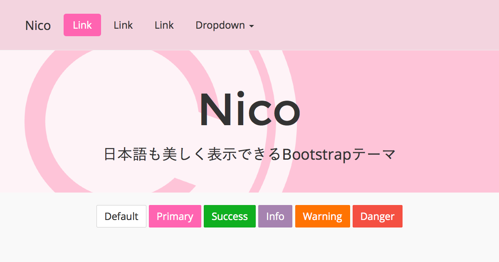

# Honoka

[http://honokak.osaka/](http://honokak.osaka/)



"Honoka" は日本語も美しく表示できるBootstrapテーマです。

## About "Honoka"

通常の[Bootstrap](http://getbootstrap.com/)では，日本語のフォント指定や文字サイズは最適とはいえません。"Honoka"はそんなBootstrapをベースに，日本語表示に適したフォント指定や，文字サイズに関するコードを追記したBootstrapテーマの一つです。

## Live Demo

[http://honokak.osaka/bootstrap.html](http://honokak.osaka/bootstrap.html)

## Usage

Honokaは単なるBootstrapテーマにしか過ぎないため，基本的な使い方は本家Bootstrapとほとんど変わりません。よって以下に書くことは[本家Bootstrap](http://getbootstrap.com/getting-started/)からの引用，もしくはその一部を変更したものです。用意されたCSSクラスやコンポーネントなど，より詳細な使い方のドキュメントは本家Bootstrapの各種リファレンスページ([CSS](http://getbootstrap.com/css/) / [Components](http://getbootstrap.com/components/) / [JavaScript](http://getbootstrap.com/javascript/))をご覧になることを推奨します。

### Package

配布しているzipファイルの内容物は以下のとおりです。``bootstrap.min.*``といったように，ファイル名に``min``がつくファイルは，改行やインデント・スペーシングをなくした(minifyされた)コードで，ユーザがウェブページを読み込む際の転送量を少なくすることができます。通常はこの``bootstrap.min.*``を使うことをおすすめします。

```
honoka/
├─ bootstrap.html
├─ css/
│   ├─ bootstrap.css
│   └─ bootstrap.min.css
├─ fonts/
│   ├─ glyphicons-halflings-regular.eot
│   ├─ glyphicons-halflings-regular.svg
│   ├─ glyphicons-halflings-regular.ttf
│   ├─ glyphicons-halflings-regular.woff
│   └─ glyphicons-halflings-regular.woff2
└─ js/
    ├─ bootstrap.js
    └─ bootstrap.min.js
```

### Basic Template

Bootstrapをつかってウェブページを作成する際に基本となるHTML部分は以下のようになります。CSSやJavaScriptのファイルパスは環境に合わせて変更する必要があります。

```html
<!DOCTYPE html>
<html lang="ja">
  <head>
    <meta charset="utf-8">
    <meta http-equiv="X-UA-Compatible" content="IE=edge">
    <meta name="viewport" content="width=device-width, initial-scale=1">
    <!-- The above 3 meta tags *must* come first in the head; any other head content must come *after* these tags -->
    <title>Bootstrap 101 Template</title>

    <!-- Bootstrap -->
    <link href="css/bootstrap.min.css" rel="stylesheet">

    <!-- HTML5 shim and Respond.js for IE8 support of HTML5 elements and media queries -->
    <!-- WARNING: Respond.js doesn't work if you view the page via file:// -->
    <!--[if lt IE 9]>
      <script src="https://oss.maxcdn.com/html5shiv/3.7.2/html5shiv.min.js"></script>
      <script src="https://oss.maxcdn.com/respond/1.4.2/respond.min.js"></script>
    <![endif]-->
  </head>
  <body>
    <h1>Hello, world!</h1>

    <!-- jQuery (necessary for Bootstrap's JavaScript plugins) -->
    <script src="https://ajax.googleapis.com/ajax/libs/jquery/1.11.2/jquery.min.js"></script>
    <!-- Include all compiled plugins (below), or include individual files as needed -->
    <script src="js/bootstrap.min.js"></script>
  </body>
</html>
```

### Grunt

このリポジトリはGruntを使った自動タスクによって，テストや配布用パッケージ生成することができます。

```
grunt server
```

テスト用サーバを起動します。``localhost:8000``に接続することで``dist/``以下のディレクトリをプレビューすることができます。また起動中にscssファイルを更新した場合，自動的にビルドされます(だがLive Reloadはされない)。

```
grunt build
```

Bootstrapに関連するファイルのビルドを行います。

```
grunt package
```

配布用パッケージを作成します。作成したファイルは``data/``ディレクトリ(``.gitignore``で無視ディレクトリに指定)の``bootstrap-honoka-dist.zip``へ出力されます。

## License

[MIT Licesne](LICENSE)

## Author

 * windyakin ([windyakin.net](http://windyakin.net/))